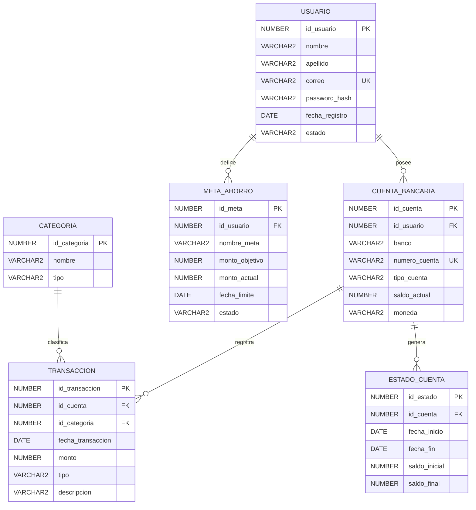

# SmartBudget FinTech - Parte Oracle

Tu parte cubre la base de datos relacional del proyecto. Oracle guarda la informacion estructurada y transaccional:

- Usuarios
- Cuentas bancarias
- Categorias
- Transacciones
- Metas de ahorro
- Estados de cuenta

## Orden de ejecucion en Oracle SQL Developer

1. Ejecuta `01_schema_oracle.sql`
2. Ejecuta `02_datos_muestra.sql`
3. Ejecuta `03_crud_pruebas.sql` por partes para tomar capturas
4. Ejecuta `04_seguridad.sql` si tienes permisos de administrador
5. Usa `05_exportacion_oracle.md` como guia para exportar

## Que capturas debes tomar

- Tablas creadas en SQL Developer.
- Diagrama entidad relacion.
- Resultado de `SELECT COUNT(*)` por tabla.
- Pruebas CRUD: INSERT, SELECT, UPDATE y DELETE.
- Trigger actualizando saldo de cuenta.
- Procedimiento almacenado ejecutado.
- Usuario/rol creado para seguridad, si tu Oracle lo permite.

## DER sugerido

